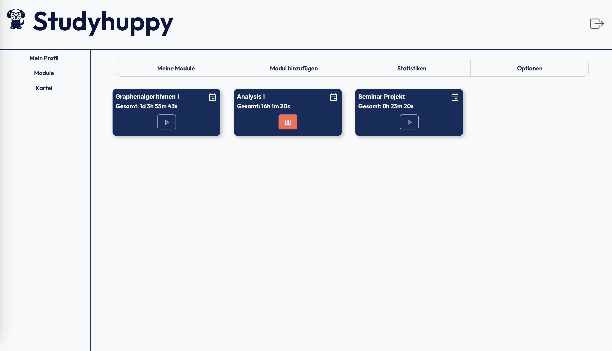
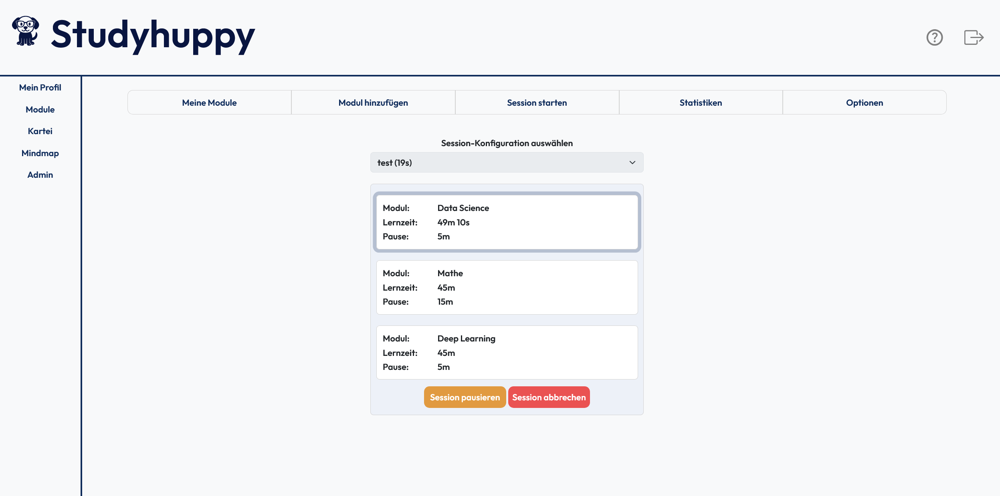
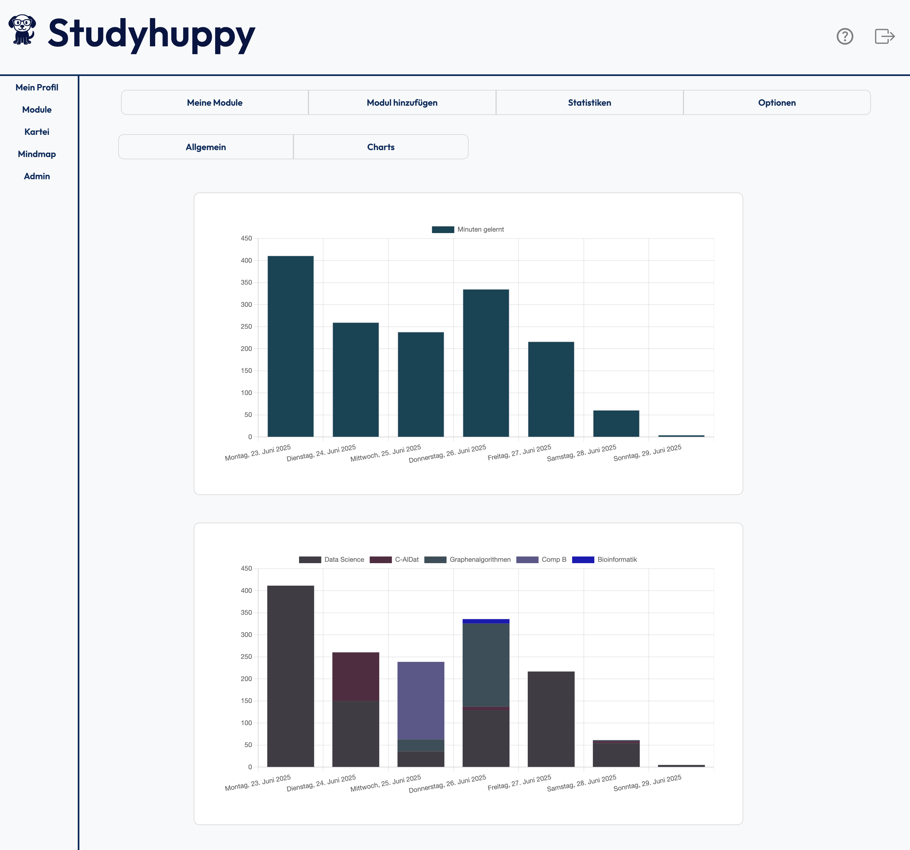
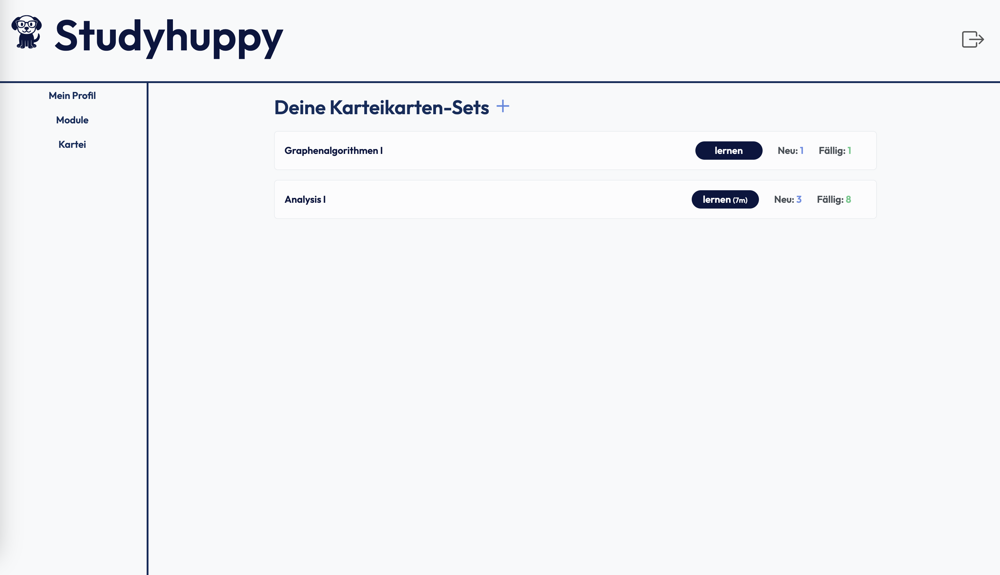
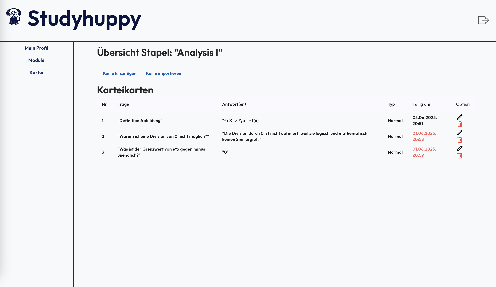
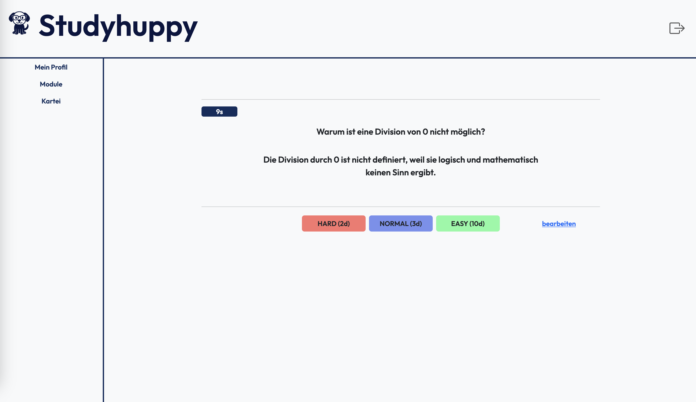
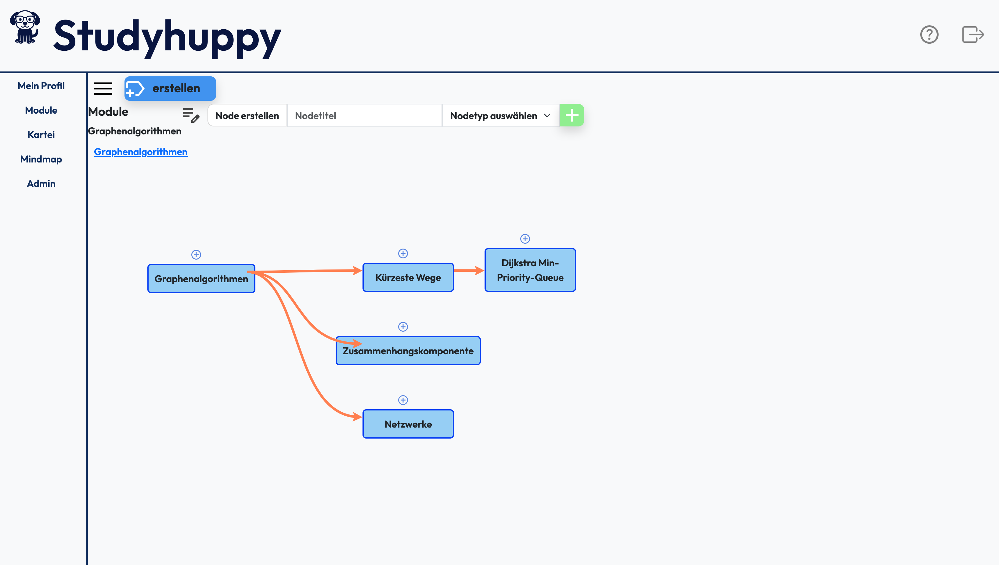

# Studyhuppy

**Studyhuppy** is a web application designed to help students organize their study time during their academic journey. It aims to combat procrastination, increase motivation, and provide a clear overview of learning performance. The app supports sustainable self-management and structured learning habits.

## Features

### Implemented

- Overview of study time for each university module
- Statistics and visualizations of learning time
- Flashcard learning using spaced repetition
- Basic creation of Mindmaps

### Planned

- A social network system for shared study sessions
- Gamification features to boost motivation

## Screenshots

### Modul Dash

### Sessions

### Statistics

### Flashcard Dash

### Flashcard Details

### Flashcard Learning

### Inside Mindmap

## Tech Stack

- **Backend**: Spring Boot 3
- **Frontend**: Angular 19, Material
- **Database**: PostgreSQL
- **Containerization**: Docker

## Contributing

This is currently a private project, but I plan to open it up for contributions in the future.

If you're interested in collaborating, feel free to reach out or fork the project!

## License

This project is licensed under the [MIT License](LICENSE).

## Author

**Timo Neske**
📧 Timo.Neske@hhu.de
📅 Started: 2025
